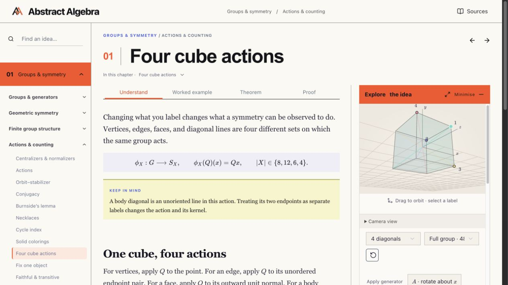
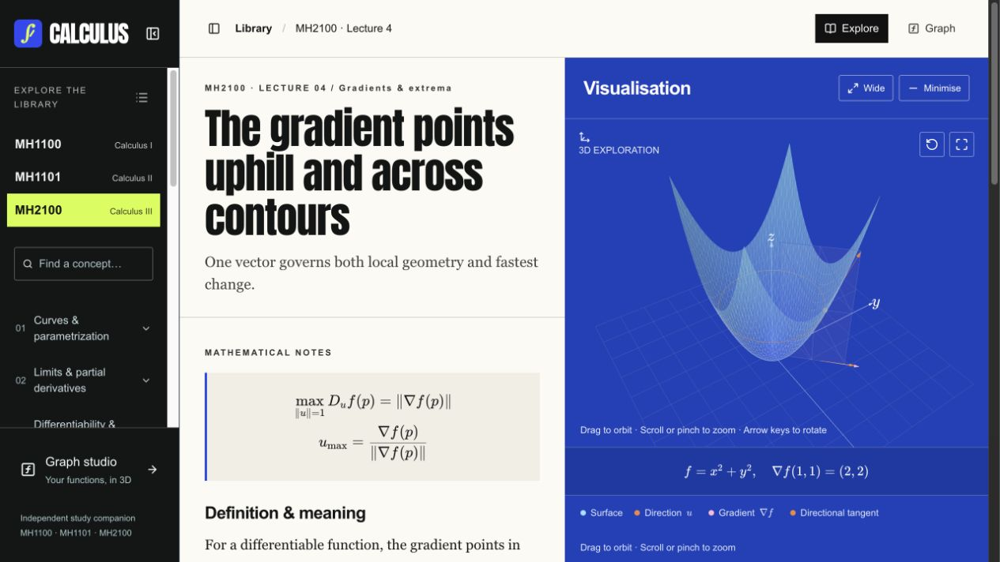

# Jerome Queck

I study mathematics and build software for the things I spend time on: learning, research, and organising my work.

[Website](https://jeromegroup.org) · [LinkedIn](https://www.linkedin.com/in/jeromequeck/) · [Jerome-Group](https://github.com/Jerome-Group)

## Contributions

[Activity links and metric definitions](https://github.com/jerome-queck/jerome-queck/tree/profile-data) · Updated daily with GitHub Actions.

## Mathematics

### [Algebra](https://algebra.jeromegroup.org)

My notes on groups, rings, fields and representations, brought to the web with visual explanations and interactive explorations. [Source](https://github.com/Jerome-Group/algebra)

### [Calculus](https://calculus.jeromegroup.org)

My notes from limits and derivatives to multivariable and vector calculus, with interactive graphs that connect calculations to geometry. [Source](https://github.com/Jerome-Group/calculus)

## Software

**[Academic OS](https://github.com/Jerome-Group/academic-os)** — The system I use to organise my degree: module and research folders, tasks, calendars, and the information behind my academic dashboard.

**[NTULearn Sync](https://github.com/Jerome-Group/ntulearn)** — Keeps a local copy of my NTULearn courses, turning pages and announcements into Markdown and saving attachments in their course folders.

**[Syrax](https://github.com/Jerome-Group/syrax)** — My personal Telegram assistant, built on OpenClaw with separate chats for academic work, media, system tasks and general use. The repo contains its setup, configuration and runtime adapter.

## Upstream contributions

**[OpenClaw](https://github.com/openclaw/openclaw)** — Fixed a failure mode where oversized Groq requests were repeatedly retried as rate limits, leaving sessions stuck. [PR #130275](https://github.com/openclaw/openclaw/pull/130275) · merged 28 August 2026.
