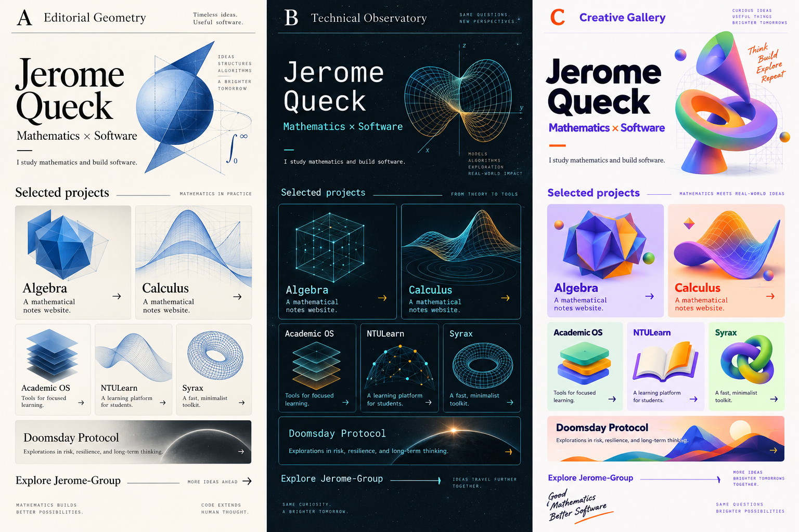

# Visual options

This board is a generated aesthetic mockup, not a GitHub screenshot. Small generated descriptions are placeholders and sometimes wrong. Use the root README for accurate copy: Doomsday Protocol is a Marvel watch tracker, NTULearn imports course content, and Syrax is a personal chatbot system.

Choose a direction or combination before final implementation. Artwork will be extracted or regenerated separately from selectable Markdown descriptions and links.
